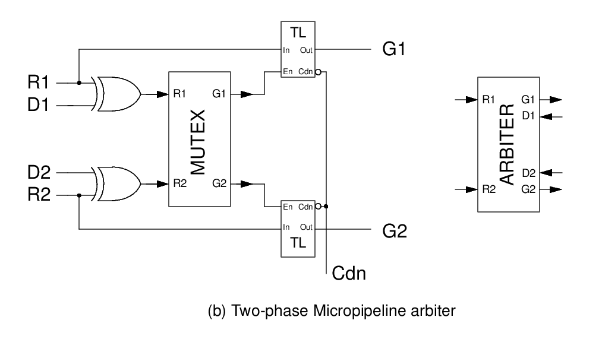

# async_logic
A collection of asynchronous logic circuits as found in the litterature

## Asynchronous standard cells

+ Mutex

+ Muller Element (Or C-Element)

## Single rail, 2-phase

### arbitrer

+ Reference : [The Design and Implementation of an Asynchronous Microprocessor](http://apt.cs.manchester.ac.uk/publications/thesis/paver94_phd.php). PhD Thesis by Nigel Charles Paver

## Single rail, 4-phase
