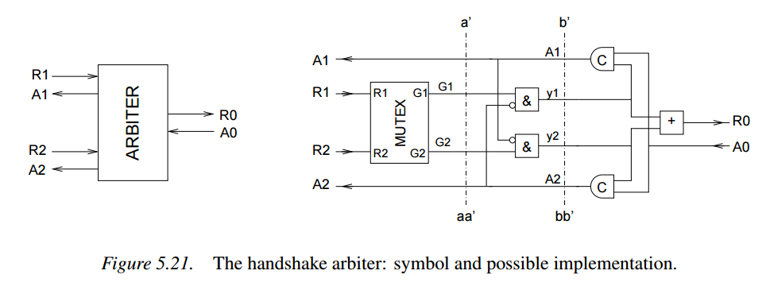
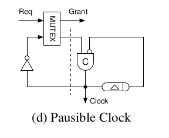

# async_logic
A collection of asynchronous logic circuits as found in the litterature

## Asynchronous standard cells

+ Mutex

+ Muller Element (Or C-Element)

## Single rail, 2-phase

### arbitrer

+ Reference : [The Design and Implementation of an Asynchronous Microprocessor](http://apt.cs.manchester.ac.uk/publications/thesis/paver94_phd.php). PhD Thesis by Nigel Charles Paver

From figure 3.16, page 42 :

## Single rail, 4-phase

### Handshake arbitrer

+ Reference : [PRINCIPLES OF ASYNCHRONOUS CIRCUIT DESIGN – A Systems Perspective
](http://www2.imm.dtu.dk/pubdb/views/edoc_download.php/855/pdf/imm855.pdf). Jens Sparsø and Steve Furber - Kluwer Academic Publishers

From figure 5.21, page 79 :

## MISC

## Pausible clock

+ Reference : Demystifying Data-Driven and Pausible Clocking Schemes. Robert Mullins and Simon Moore - Computer Laboratory, University of Cambridge

From figure 1, page 2 :

